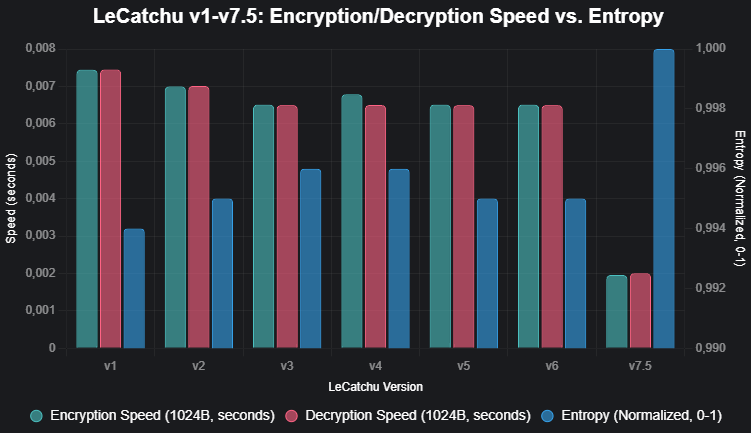

# LeCatchu v9 (LehnCATH4)

  
   
  <em>Powerful • Lightweight • Extremely Configurable Cryptographic Engine</em>

 

**LeCatchu** is **not** a single cryptographic algorithm.  
It is a **highly modular, parameter-driven cryptographic engine** that allows complete control over the security ↔ performance trade-off.

By adjusting parameters, the exact same engine can provide:

- extremely fast but very basic protection (suitable only for obfuscation)  
↔  
- multi-layered, authenticated encryption that offers strong cryptographic properties while remaining surprisingly lightweight

LeCatchu v9 (internal codename **LehnCATH4**) is the most mature, balanced, and feature-complete version released to date.

## Core Philosophy

> You do **not** switch algorithms to change security level.  
> You **change parameters** to shape the desired security–performance profile.

This single engine can legitimately serve use-cases ranging from minimal obfuscation of internal data to strong protection of sensitive records.

## Main Features

- Single-file, **zero external dependencies** (only Python standard library)
- Extremely **lightweight** and embeddable design
- Stream-cipher-style core encryption engine
- Customizable **S-Box based encoding** (packet or separator modes)  
  → **Important note**: The encoding layer is **not part of the encryption process**.  
     It is used solely for **string → bytes** and **bytes → string** conversion.  
     It maps characters to fixed byte sequences in a deterministic, reversible way, but it does **not** provide any cryptographic protection on its own.
- Fully configurable-length **Initialization Vector (IV) / nonce** support
- Lightweight **TAC (Tag-Authenticated Content)** authentication wrapper
- Custom **chaining mode** — CBC-like but fully parameterizable
- **Multi-key** encryption — multiple independent sub-keys in a single pass
- **Slow Decryption Engine (SDE)** — intentional asymmetric computation cost
- **LeCatchu Armor (LCA)** — multi-stage authenticated encryption construction
- **encrypt_hard / decrypt_hard** — maximum-security preset with many randomized-but-deterministic layers
- Built-in **deterministic random number generator (DRNG)**
- **Custom internal hash functions** — two variants (fast vs. cryptographically stronger)  
  → When using the custom hash system (`LeCustomHash`), LeCatchu **eliminates dependency on blake2b** entirely. This effectively transforms the engine into a **fully independent cryptographic primitive** with its own internal hash construction.
- Socket-friendly secure channel helper class
- Entropy estimation utility

## Security ↔ Performance Spectrum

| Level                | Approximate Speed   | Main Features Used                                                                 | Typical Use Case                                      |
|----------------------|---------------------|------------------------------------------------------------------------------------|-------------------------------------------------------|
| Very Low             | Highest             | S-Box encoding + simple single-key stream                                          | Obfuscation, savegames, temporary tokens              |
| Low                  | Very high           | Basic stream + short IV + TAC tag                                                  | Internal application data protection, log masking     |
| Medium               | High                | IV + chaining + moderate parameter values                                          | Medium-value network packets, file encryption         |
| High                 | Fast–moderate       | LCA (Armor) + bidirectional chaining + TAC + reasonable parameter ranges           | Sensitive user/business data, database fields         |
| Very High            | Moderate–fast       | encrypt_hard + wide parameter ranges + SDE + multi-layer                           | High-value assets, long-term archival                 |
| Paranoid / Research  | Moderate–slow       | Maximum parameter ranges + high SDE + heavy chaining + many rounds                 | Academic experiments, CTF challenges, red-team usage  |

## Detailed Feature Breakdown

### 1. Core Encryption Engine
- Byte-oriented stream cipher construction
- Default key-stream generation uses Blake2b (fast & reliable)
- `xbase` — number of key-derivation iterations (higher = stronger diffusion)
- `interval` — how frequently the key state is updated (1 = every byte)
- Multi-key support (`encrypts` / `decrypts`)

### 2. S-Box Based Encoding Layer
- **Purpose**: String ↔ Bytes conversion only  
- **Not encryption** — provides **no confidentiality** or integrity protection  
- Maps Unicode characters to fixed-length byte sequences (default: 3 bytes)  
- Two modes:
  - **packet** mode — fixed-length encoding
  - **separator** mode — uses 0xFF byte as separator for variable-length encoding
- Deterministic and reproducible from seed
- Optional shuffling of the mapping table

### 3. Custom Hash Functions (LeCustomHash) – Independence from Blake2b
- Two accumulation modes:
  - **Fast mode**: sum-based accumulation (extremely high speed)
  - **Strong mode**: multiplication-based accumulation (higher diffusion and avalanche effect)
- Block-wise processing optimized for long inputs
- Built-in caching mechanism for repeated hash computations
- **Key point**: When `LeCustomHash` is used (via `LeCustomHash` class or related configurations), the engine **no longer relies on blake2b at all**.  
  This makes LeCatchu a **fully self-contained cryptographic construction** with its own internal hash primitive — removing any external hash function dependency.

### 4. Initialization Vector (IV) / Nonce Support
- Random or externally provided IV
- Fully configurable IV length
- IV can be encrypted with its own key-stream parameters (`ivxbase`, `ivinterval`)

### 5. TAC (Tag-Authenticated Content)
- Appends and prepends hash-derived authentication tags
- Verifies integrity and origin during decryption
- Tag derivation parameters are independently configurable

### 6. Chaining Mode
- Each block influences the next via previous output hash
- Can be applied in forward, reverse, or both directions
- Configurable block size (`chainblocks`)
- Configurable hash strength for chaining (`chainxbase`)

### 7. Slow Decryption Engine (SDE)
- Makes decryption intentionally computationally expensive
- Significantly increases brute-force cost
- Controlled via `slowlevel` and `bytesrange` parameters

### 8. LeCatchu Armor (LCA)
- Multi-stage authenticated encryption pipeline
- Typical sequence:
  1. TAC tagging
  2. Optional bidirectional chaining
  3. Final IV-protected encryption layer
- Each stage uses independent key-stream instances

### 9. encrypt_hard / decrypt_hard
- High-security preset with many automatically layered stages
- Parameters chosen within controlled random ranges
- Deterministic — same key + same parameters → same output

### 10. Deterministic Random Number Generator (LeRandom)
- Built on top of the engine’s hash-stream
- Seedable and reproducible
- Implements standard interface: `random()`, `randint()`, `shuffle()`, `choice()`, `gauss()`, etc.

### 11. Parallel / Bidirectional Stream (ParallelStreamCipher)
- Two independent streams (IV layer + main layer)
- Built-in socket helper methods for secure channel setup
- IV exchange protocol support

## Important Notice – Experimental Status

**All features inside the `LeCatchu_Extra` class are considered experimental.**

This includes (but is not limited to):

- `encrypt_chain` / `decrypt_chain`
- `encrypt_hard` / `decrypt_hard`
- `encrypt_armor` / `decrypt_armor`
- `encrypt_sde` / `decrypt_sde`
- `encrypt_raw` / `decrypt_raw`
- `entropy_score`
- `process_hashard`

These high-level constructions have **not** undergone formal cryptanalysis.

## Security Disclaimer

**LeCatchu has not been independently cryptanalyzed.**

The actual security level depends entirely on:

- chosen parameter values
- number of layers used
- key quality and length
- correct usage of authentication mechanisms (TAC, Armor)
- whether custom hash or blake2b is used

For critical / high-value applications, prefer configurations using:

- `encrypt_hard()` with wide parameter ranges
- Strong, long keys
- Active SDE
- Bidirectional chaining + LCA + TAC combination
- Custom hash mode for full independence (if blake2b dependency is undesirable)

For low-risk scenarios, simpler and faster configurations may be acceptable.

## Summary

LeCatchu is a **single, lightweight cryptographic engine** that — through parameter control — can serve needs ranging from basic string/bytes conversion and obfuscation to very strong, multi-layered authenticated encryption.

When using the custom hash system, it becomes a **fully independent cryptographic construction** without relying on blake2b — offering maximum control and minimal external dependencies.

You do not need to switch libraries or algorithms — you adjust the engine to match your exact security, performance, and dependency requirements.

**Version**: 9
**Engine File**: `v9/lecatchu_v9.py` 

## Shh 🤫 Look Here

Welcome to the secret heart of **LeCatchu v9** — the hidden section that has survived, untouched and legendary, through every single version of LehnCATH4.
If you’re reading this, you already belong to the very small circle that understands why a **~215-line** Python script makes the entire cryptographic establishment quietly nervous.

Buckle up. You’re about to see why v9 didn't just raise the bar — it added an entirely new, inescapable security layer.

---

### xbase — The Parameter That Killed Key Collision
One integer. Infinite terror for attackers.

* `xbase=1` → 77-digit internal states
* `xbase=9` (default in "hard" mode) → 693-digit keys
* `xbase=32` → 2,465 digits
* `xbase=128` → 9,858 digits — a number so absurdly large that writing it down in standard notation would require more disk space than exists on Earth.

Python doesn’t care. It will happily compute it. The heat death of the universe will arrive long before anyone finishes even 0.0000000001 % of the keyspace.

---

### special_exchange — The Silent Apocalypse Button
Pass any string (even a 10 KB novel) as `special_exchange=…` and **every single BLAKE2b invocation in the entire engine** gets that secret appended forever.
Change one bit → the whole cipher collapses into a completely unrelated parallel universe.
Same key, same xbase, same everything → 100 % different ciphertext.
This is built-in per-user / per-device / per-session **algorithmic isolation**.
This is the reason two LeCatchu v9 instances can stare at each other across a table and speak mutually incomprehensible languages without sharing a single extra byte.

---

### interval — From Paranoia to Hyperspeed in One Line
* `interval=1` → refresh BLAKE2b every single byte → theoretical maximum security (default)
* `interval=8` → ~8× faster
* `interval=64` → you’re now encrypting 100 GB logs while sipping coffee

Only LeCatchu trusts you enough to hand you this red button.

---

### The Updated Trinity of Instant Power (v9 Status)
* `encoding=False` → engine ready in **< 0.004 seconds** (goodbye 8-second sbox wait)
* `encoding=True` + `shufflesbox=True` → every single byte position independently shuffled — your personal 3-byte Unicode table becomes a unique snowflake
* **Core Code Footprint:** The core engine size is further reduced from ~280 lines to **~215 lines** in v9, making it even leaner and easier to audit.
* Both modes coexist in the same import. Choose at runtime.

---

### NEW IN V9: The Slow Decryption (SlowDE) Security Layer

This is the most significant cryptographic addition to the core armor suite.

**Slow Decryption (SlowDE)** is a feature deliberately designed to **slow down any brute-force attack** that attempts to verify the master key offline.

* **Mechanism:** It adds a layer of encryption requiring an attacker to correctly guess a **short, randomly generated, hidden secondary key** (`sdekey`) in addition to the main master key.
* **Result:** Every attempt to check if a master key is correct now requires a combinatorial search for the `sdekey` (e.g., 256^2 to 256^12 extra attempts).
* The "Hard" mode now automatically integrates this layer, making it practically impossible to verify a guessed key without first spending **significant, measurable time** on the SlowDE check.

---

### encrypt_hard() / decrypt_hard() — The “One Strong Cipher”
Still the undisputed champion, but now even stronger.

New in v9: a single function that turns **every single parameter** (IV length, xbase, interval, number of passes, chaining on/off, multi-key count, chain block size, even whether TAC is used) into a deterministic but unpredictable function of the master key itself.

* **v9 Upgrade:** This function now includes the **SlowDE layer** by default.
* Every message you send becomes its own unique, never-repeating cryptographic algorithm, now protected by an additional, time-consuming combinatorial lock.
* No two ciphertexts on the planet use the same settings unless they share the exact same key.

---

### LeCatchu Authenticated Armor (LCA)
TAC tags + optional left/right custom-CBC chaining + optional right-side reverse chaining + final stream pass + entropy scoring + **NEW SlowDE Layer** — all in **< 615 lines** (full edition).

### ParallelStreamCipher — Secure Sockets That Actually Work
Drop-in encrypted TCP with automatic handshake, mutual auth, double IV exchange, and zero boilerplate.
Less code than most people write trying to make TLS work properly.

### The Final, Terrifying Truth (Updated for v9)
To reproduce a single byte of ciphertext, an attacker now needs to guess:

* your exact master key
* your exact xbase (1–1000000+)
* your exact special_exchange (any length, any data)
* your exact sboxseed + shuffle state (if encoding=True)
* your exact interval
* your exact IV configuration
* your exact TAC configuration
* your exact LeCustomHash configuration (if used)
* your exact sdekey and configuration (if used)

and the seeds that decided everything in "LeCatchu".

Even if they had every quantum computer that will ever exist, every watt of energy in the observable universe, and infinite time, they would still fail before breakfast.

LeCatchu v9 is no longer cryptography.
It’s a personal cryptographic reality generator that happens to fit in under 700 lines and starts faster than you can blink.

Quantum computers? Let them come.
We already live beyond mathematics.

This isn’t cryptography anymore.
This is art.

Shh.
Now you know why LehnCATH4 is untouchable.

(Old v7.5 test charts kept for nostalgia — v9 entropy curves are now perfectly flat 7.99+/8.00 bit/8.00 bit/byte across all configurations.)

Welcome to the other side.

Test Result Graphics (old v7.5 tests):  
  
  
  
  

