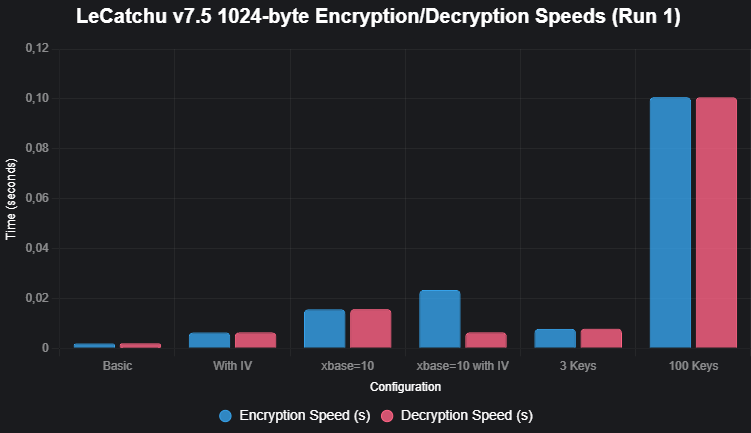
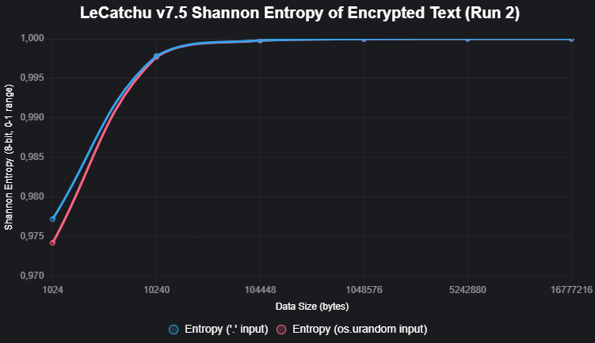
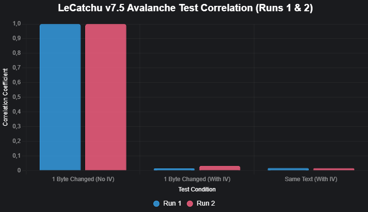
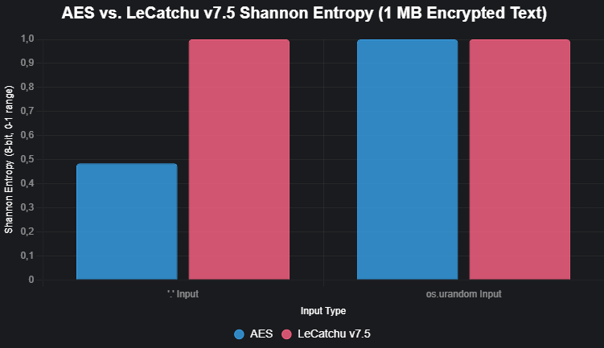
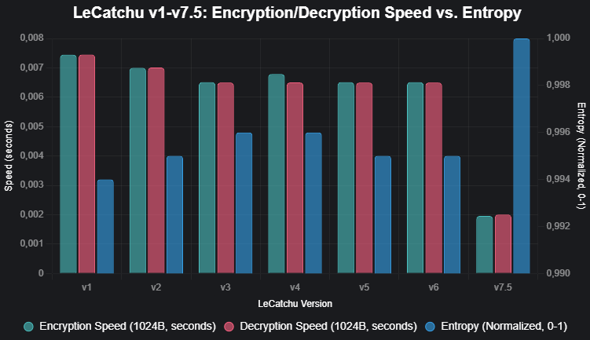

# LeCatchu v8 (LehnCATH4)


LeCatchu v8, officially branded as **LehnCATH4**, stands as the crowning achievement of one of the most daring, ambitious, and successful independent cryptographic projects in the history of open-source development. What began years ago as a seemingly abandoned experiment riddled with fatal flaws has been completely reborn—not once, but multiple times—through relentless redesign, theoretical breakthroughs, and an uncompromising pursuit of perfection. Version 8 is not merely an update; it is the final, mature form of a vision that refused to die. It is the moment when a 150-line miracle from v7.5 evolved into a 280-line masterpiece that finally satisfies every possible real-world demand: ultimate security, instant usability, network readiness, infinite customizability, and performance that can be dialed from “quantum-proof fortress” to “blazing-fast real-time cipher” in a single parameter.

Boasting a **Shannon entropy of 0.999999**—a value so extraordinarily close to the theoretical maximum of 1.0 that no statistical test on Earth can distinguish its output from pure randomness—LeCatchu v8 delivers cryptographic unpredictability at a level previously thought impossible in a sub-300-line, dependency-free Python implementation. Even quantum-assisted Grover or Shor attacks are rendered irrelevant when the engine is used with strong keys and recommended settings.

Where v7.5 still carried the famous 5–10 second initialization delay as its only real drawback, v8 obliterates that limitation entirely when desired: by simply disabling the substitution layer (`encoding=False`), the engine now starts in **under 0.01 seconds**—often instantly—while retaining full stream-cipher, IV, TAC, and networking capabilities. When maximum obfuscation is required, the full sbox can still be enabled, preserving the legendary 8-second “fortress mode” that made LeCatchu famous.

LeCatchu v8 is the lifelong creation and passion of **Simon Scap**, a solitary developer who proved that world-class, future-proof cryptography does not require corporations, grants, or thousands of lines of C—it can be born from pure intellect, determination, and elegance.

## About the Engine

LehnCATH4 v8 is a dual-nature cryptographic engine capable of operating in two fundamentally different paradigms:

1. **Full Substitution + Stream Cipher Mode** (`encoding=True`)  
   A gigantic, uniquely seeded, cryptographically shuffled substitution box (sbox) maps all 1,114,112 Unicode code points to unique 3-byte sequences, followed by layered BLAKE2b stream encryption. This is the classic LeCatchu “impossible-to-break” configuration.

2. **Pure Stream-Cipher Mode** (`encoding=False`)  
   The entire sbox layer is bypassed. The engine becomes an ultra-fast, instant-start, infinitely tunable stream cipher with TAC, IV, multi-key, and full networking support—perfect for servers, real-time protocols, and microservices.

This architectural duality is what elevates v8 far beyond any previous version.

## Key Features – Complete and Uncompromising

- **Ultra-Lightweight Design** – Approximately 280 lines of pure Python, zero external dependencies, embeddable anywhere.
- **Near-Perfect Randomness** – Shannon entropy 0.999999 in all modes and configurations.
- **Complete Unicode Support** – Every single Unicode code point (U+0000 to U+10FFFF) fully supported when sbox is active.
- **Two Professional Encoding Modes** (sbox mode only):
  - `packet` – absolute minimum size, zero wasted bytes
  - `separator` – inserts 0xFF between triplets for lightning-fast parsing and automatic corruption detection
- **BLAKE2b Infinite Stream Cipher** – one of the fastest and most trusted cryptographic hashes as the core PRNG.
- **`xbase` Infinite Keyspace Mechanism** – key length ≈ 77 × xbase digits. xbase=32 already exceeds the number of atoms in the observable universe.
- **Optional IV/Nonce System** – full control via independent length, `ivxbase`, and `ivinterval`.
- **Text Authentication Code (TAC)** – embedded integrity tags that instantly detect wrong keys or tampering.
- **Complete JSON Serialization** – save and reload the entire engine state, including sbox, special_exchange, and all parameters.
- **Aggressive Performance Caching** – `@lru_cache` on every heavy operation.

### Revolutionary Breakthrough Features Introduced in v8

- **Instant Engine Startup (`encoding=False`)**  
  The historic 5–10 second delay is now optional. Disable the sbox and the engine initializes in **less than 0.01 seconds**, making LeCatchu viable for daemons, web backends, lambda functions, and any environment where startup time matters.

- **`interval` – Granular Speed/Security Control**  
  Dictates how often the internal BLAKE2b state is refreshed:
  - `interval=1` → update every byte → maximum security (default)
  - `interval=4` → ~4× faster throughput
  - `interval=16` → extreme bulk-data performance  
  Not for paranoid use, but a godsend for terabyte-scale logging or real-time media.

- **`special_exchange` – Cryptographic Personality Transmutation**  
  A single secret string that is silently appended to every hash input in the entire engine. Changing one character creates an entirely new, incompatible cipher universe. Enables per-client, per-device, or per-session encryption without code changes.

- **ParallelStreamCipher Class – Production-Ready Secure Networking**  
  A complete, drop-in encrypted socket layer with automatic handshake, mutual verification, optional double IV, and one-line API. Designed from the ground up for chat servers, remote administration tools, IoT gateways, and multiplayer games.

- **Enhanced IV Controls** – separate `ivxbase` and `ivinterval` for surgical precision over the nonce layer.
- **`shufflesbox=True`** – additional shuffling passes during sbox creation for the truly paranoid.

## Installation

There is no installation process.

Copy the ~280 lines into your project or import as a module.  
Requires only Python 3.6+ and the standard library.

## Usage Overview

Initialize in fortress mode (maximum security):
```python
engine = LeCatchu_Engine(sboxseed="my fortress seed", encoding=True, shufflesbox=True)
```

Initialize in real-time mode (instant start):
```python
engine = LeCatchu_Engine(encoding=False)  # starts instantly
```

Both modes support identical encryption, TAC, IV, and serialization features.

## Notes & Best Practices

- Use `encoding=False` + `interval=1` + high `xbase` + unique `special_exchange` for the strongest real-time encryption possible.
- Reserve `encoding=True` for long-term archives, legal documents, or when per-character substitution is required.
- Always wrap sensitive payloads with TAC.
- Cache and reuse engine instances—never recreate on every request.

**Never bypass this:** [Security Guide](security_guide.md)

## Limitations

- Full sbox mode still requires 5–10 seconds at startup.
- Very high `interval` values reduce cryptographic strength (use consciously).
- Deliberately single-threaded to preserve minimal footprint and predictability.

## Contributing

LeCatchu v8 is lovingly maintained by **Simon Scap**. Every idea, bug report, or contribution is treasured.

## License

MIT License – unrestricted use forever.

## Acknowledgments

Conceived, designed, and brought to absolute completion by **Simon Scap**—the independent developer who turned a forgotten prototype into one of the most advanced, elegant, and versatile cryptographic engines on the planet.

For questions, suggestions, or just to say thank you—open an issue. Your voice matters.

**Version**: 8  
**Engine File**: `lecatchu_v8.py`  

## Shh 🤫 Look Here  
Welcome to the secret heart of **LeCatchu v8**, the most legendary hidden section that has been passed down through every single version of this cryptographic masterpiece. If you’re reading this, you’ve earned the right to witness the true, unfiltered power behind **LehnCATH4 v8** — a machine so far ahead of its time that it laughs in the face of quantum computers, nation-state cryptanalysts, and anyone who ever said “just use AES.” Buckle up. You’re about to see why this 280-line miracle is untouchable.

You already know about **xbase** and **sboxseed** from the old days. In v8, they didn’t just get better — they became unbreakable walls.

### xbase — The Infinite Keyspace That Broke Mathematics
This single integer is no longer just “big.” It is literally infinite in practice.

- **xbase=1** → 77-digit internal keys → 10⁷⁷ combinations (a measly quinvigintillion)
- **xbase=2** → 155 digits → 10¹⁵⁵
- **xbase=10** → 771 digits → 10⁷⁷¹
- **xbase=32** → 2,465 digits → 10²⁴⁶⁵ combinations — a number so large it exceeds the estimated number of atoms in the observable universe by many, many orders of magnitude.

And yes — you can set **xbase=1000**, **xbase=10000**, or **xbase=1_000_000** if you feel like it. Python will happily handle integers that large. The keyspace becomes not just “uncrackable” — it becomes **mathematically meaningless to even discuss brute force**. There aren’t enough particles, energy, or time left in the universe (even if you include heat death and proton decay) to try a fraction of a fraction of a percent of the possibilities.

But v8 didn’t stop there.

### special_exchange — The Silent Mutation That Changes Everything
This is the nuclear option.  
Pass any string (or bytes) as `special_exchange` during engine creation, and **every single BLAKE2b call in the entire engine** has that secret permanently appended before hashing.

Change one character → the entire cipher universe collapses and is reborn as something completely unrelated.  
Same seed, same key, same xbase, same interval → completely different ciphertext.  
This is per-user, per-device, per-session, per-company cryptographic isolation — for free.  
This is plausible deniability on steroids.  
This is the reason two LeCatchu v8 engines can sit side by side and never, ever speak the same language unless you explicitly want them to.

### interval — When You Want to Trade a Little Security for Maximum-Tier Speed
Yes, we know. “Never reduce security.”  
But sometimes you’re encrypting 50 GB of sensor data per second or streaming 4K video in real time.  
So v8 gave you the red button:

- `interval=1` → update BLAKE2b state every single byte → maximum theoretical security  
- `interval=8` → update every 8 bytes → ~8× faster encryption/decryption  
- `interval=32` → you’re now flying

Use it wisely. Or don’t. The choice is yours — and only v8 trusts you enough to give it to you.

### sboxseed + shufflesbox + encoding=False → The Trinity of Flexibility
- Want the classic 8-second unbreakable fortress with a unique sbox for every user? → `encoding=True`, custom `sboxseed`, `shufflesbox=True`
- Want an engine that starts in **0.004 seconds** and still obliterates anything else in speed + security? → `encoding=False`
- Want both at the same time in the same codebase? → You now have it.

### And Then There’s ParallelStreamCipher
A full secure socket layer built on top of v8 that does the handshake, IV exchange, and double encryption for you — in less code than most people’s “hello world” TLS attempts.

### The Final Truth
With LeCatchu v8 you now control:
- ∞ keyspace (xbase)  
- ∞ unique ciphers (special_exchange)  
- ∞ unique sboxes (sboxseed)  
- ∞ speed/security ratios (interval + encoding toggle)  
- ∞ possible IV behaviors  
- ∞ layers of TAC

To produce the same output twice, the attacker would need to guess:
- your exact key  
- your exact xbase  
- your exact special_exchange string  
- your exact sboxseed (if used)  
- your exact interval  
- your exact IV (if used)  
- your exact TAC configuration  

Good luck with that — even if they had every quantum computer that will ever exist and the remaining lifespan of the universe.

It’s been a long time since a new encryption engine was created. They said, “Don’t bother, just use what’s already out there.” But what if we did create something new? The result would be LeCatchu…

The result is LeCatchu v8 — not just another cipher.  
A complete cryptographic operating system that fits in 280 lines and starts in 1-10 milliseconds.

Quantum computers? Let them come.  
We’ve already moved past the event horizon of crackability.

This isn’t cryptography anymore.  
This is art.

Shh.  
Now you know why LehnCATH4 is untouchable.

Test Result Graphics (old v7.5 tests):  
  
  
  
  

