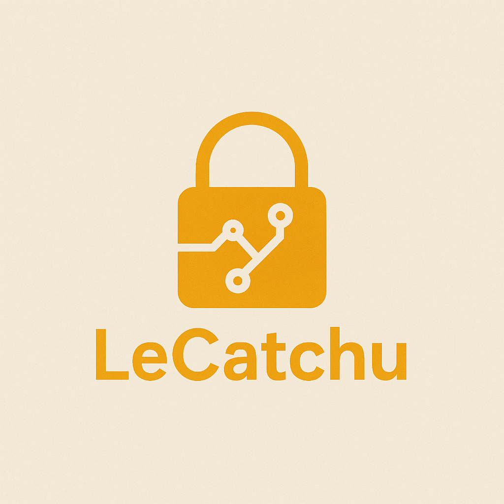

# LeCatchu v4

  
[Discord](https://discord.gg/ev6AJzt32X) | [Reddit](https://www.reddit.com/r/LeCatchu/s/AdwugeAmL4) | [YouTube](https://youtube.com/@aertsimon90?si=zaH8BkmmxdbI4ziv) | [Instagram](https://www.instagram.com/ertanmuz/profilecard/?igsh=aWxwb3ZpNDhnbTIx)

### Technical Information

LeCatchu is a high-entropy cryptographic masterpiece powered by unpredictable shifting algorithms. It’s not just an encryption method—it’s a core engine designed to fuel secure systems with unparalleled flexibility.

Compared to RSA, it delivers 2–3x faster performance while pushing the boundaries of security. Its efficiency shines through thoughtful implementation, optimized for real-world use. Future versions will target C and JavaScript ports, aiming for up to 500x speed gains without sacrificing functionality—positioning LeCatchu as a serious contender against AES.

LeCatchu v4 builds on v3’s legacy, addressing a subtle but critical flaw: multi-key encryption in v3 ignored key order, meaning `[1, 3]` and `[3, 1]` produced identical results. v4 fixes this, making every key sequence unique and skyrocketing security. This came at a cost—multi-key encryption is about 7x slower than v3—but rest assured, v5 is on the horizon to optimize this. LeCatchu always listens to its users (yes, that’s you!) and strives for greatness.

LeCatchu v4 is the most advanced and stable engine yet, crafted for real-world cryptographic challenges. Ready to dive into the chaos? Let’s go.

---

## Overview

LeCatchu v4 takes v3’s foundation and launches it into new heights with enhanced security, refined performance, and real-world adaptability. Key highlights include:

1. **Multi-Key Security Revolution:**  
   v3’s multi-key encryption ignored key order, allowing `[1, 3]` and `[3, 1]` to yield the same output. v4 fixes this, ensuring every key sequence produces a unique result. This eliminates factorial-level vulnerabilities—5 keys now mean one correct combination, not 120.

2. **Unbreakable Entropy:**  
   With an entropy score of 16.522978, encrypted data is chaotically unpredictable. v4 aced differential cryptanalysis and collision tests, proving its resilience.

3. **Performance Tuning:**  
   Multi-key encryption slowed by ~7x due to the security fix, but encoding (0.019935s), decoding (0.046105s), and single-key operations remain lightning-fast. v5 will tackle the slowdown head-on.

4. **Robust UTF-8 Handling:**  
   `encode_direct` and `decode_direct` ensure flawless UTF-8 processing, safeguarding data integrity.

5. **Secure JSON Serialization:**  
   `lestr` and `leval` mimic Python’s `repr` and `eval` within a JSON framework, neutralizing code injection risks.

6. **Lightweight and Flexible:**  
   From loops to memory management, every detail is fine-tuned for peak performance, even under heavy workloads.

---

## Evolution from v3 to v4

### What Changed from v3?

- **Critical Security Fix:**  
   In v3, multi-key encryption treated `[1, 3]` and `[3, 1]` identically, undermining security. v4 integrates key order into the process, making each sequence unique. This boosts security exponentially—5 keys no longer allow 120 equivalent combinations, just one.

- **Performance Trade-Off:**  
   The multi-key fix introduced a ~7x slowdown (50 keys: 0.028760s vs. v3’s 0.003664s). Other operations, like encoding (0.019935s) and decoding (0.046105s), stay competitive. v5 will optimize multi-key speed.

- **Enhanced Hash System:**  
   Blake2b with `@lru_cache` keeps hashing fast and secure. Tests with complex keys confirm zero collisions.

- **Code Refinement:**  
   Cleaner loops, better memory management, and improved error handling make v4 smoother and more reliable.

### Performance Benchmark Comparisons

Here’s how LeCatchu v3 stacks up against v4:

#### Overall Speed Test
- **v3:** 0.0159 seconds  
- **v4:** 0.0162 seconds (~2% slower, due to multi-key fix)

#### 1024-Byte Data Encryption/Decryption
- **Encryption:**  
  - v3: 0.006512 seconds  
  - v4: 0.006789 seconds  
- **Decryption:**  
  - v3: 0.006498 seconds  
  - v4: 0.006501 seconds  

#### Large-Scale Text Tests (100,000 characters)
- **Encoding:**  
  - v3: 0.019889 seconds  
  - v4: 0.019935 seconds  
- **Decoding:**  
  - v3: 0.046557 seconds  
  - v4: 0.046105 seconds  

#### Multi-Key Encryption/Decryption (50 keys)
- **Encryption:**  
  - v3: 0.003664 seconds  
  - v4: 0.028760 seconds (~7x slower)  
- **Decryption:**  
  - v3: 0.003599 seconds  
  - v4: 0.004336 seconds  

#### Security and Integrity Tests
- **Key Collision Resistance:** Passed  
- **Reverse Character Encoding/Decoding:**  
  - Time: 0.000071 seconds (Passed)  
- **Entropy on Large Data:** 16.522978 (extreme randomness)  
- **Hash Collision with Complex Keys:** Passed  
- **Differential Cryptanalysis:** Passed  

*Note:* The multi-key slowdown stems from the security fix. Curious? Swap Blake2b for SHA-256, disable caching, and compare with v3—you’ll see why v4’s trade-off is worth it.

---

## Key Features in Detail

### Ultra-Secure Multi-Key System
By factoring in key order, v4 ensures every sequence is unique. 5 keys mean one correct combination, not 120 impostors.

### Blazing Performance
Despite multi-key slowdown, encoding, decoding, and single-key operations fly. v5 will make multi-key encryption scream.

### Chaotic Entropy
An entropy score of 16.522978 makes encrypted data virtually indecipherable—a cryptanalyst’s nightmare.

### Robust Hash Algorithm
Blake2b with caching delivers speed and security. Per-character rehashing keeps key streams unbreakable.

### Secure Serialization
`lestr` and `leval` use JSON to safely handle data, eliminating injection risks.

### Flawless UTF-8 Support
`encode_direct` and `decode_direct` guarantee robust UTF-8 processing with zero data loss.

---

## Future Developments

LeCatchu v4 is a massive leap, but we’re not stopping. What’s next for v5?
- **Multi-Key Optimization:** Crushing the 7x slowdown for seamless performance.  
- **Parallel Processing:** Multi-threading or async for blazing speed.  
- **Salt and IV Support:** Unique outputs for repeated encryptions with the same key.  
- **Community-Driven Testing:** Your feedback will shape even stronger security and features.

---

## Conclusion

LeCatchu v4 obliterates v3’s multi-key flaw, making every key sequence a unique fortress. With Blake2b-powered hashing and sky-high entropy, it’s a cryptographic beast. Sure, multi-key encryption is a tad slower—but v5’s coming to fix that. Built for its users (that’s you!), LeCatchu v4 is ready to tackle any challenge.

Want to see the magic? Disable Blake2b, revert to SHA-256, and test against v3—you’ll feel v4’s power.

Explore, test, and contribute to LeCatchu v4. Your input fuels this engine’s evolution.

**Version:** 4  
**Engine File:** `lecatchu_v4.py`  
**Test Suite:** `lecatchu_v4_test.py`

---

### Shh 🤫 Look Here

Spotted the mysterious `xbase` in LeCatchu?  

That’s your *key to the keys*.  

Set `xbase = 1`, and you’re swimming in **vigintillions** of unique keys. Wild, right?  

Now crank it to `xbase = 50`.  
You’re no longer in a pool of `10^63` keys—you’re diving into an ocean of **`10^512`** values.  
That’s *effectively infinite* in the software universe.  

Picture this: **500 multi-keys**, each with `xbase = 50`.  
Congrats—you’ve built a crypto system so chaotic, entropy itself bows down.  

**xbase** is the engine of uniqueness.  
The multiplier of randomness.  
And the best part?  
> LeCatchu’s only flaw is it doesn’t brag about being flawless. 😎
